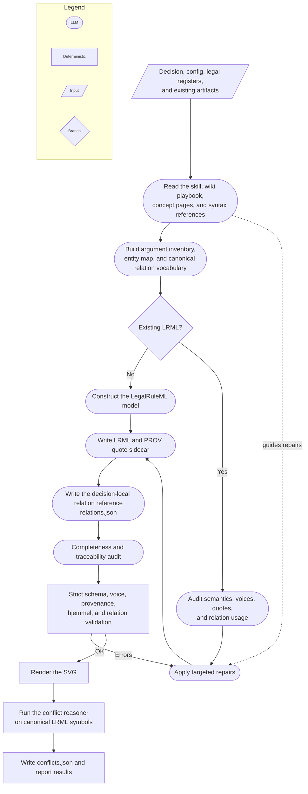

# Vedtak → LegalRuleML

This document describes a self-contained capability: **turning a Norwegian
Skatteklagenemnda _vedtak_ (tax-appeal decision) into a
[LegalRuleML](https://www.oasis-open.org/committees/legalruleml/) file that
represents its legal argumentation**, plus the tools that validate, visualize,
and search those files.

It is written so that a human or an AI agent can read it once and know **which
files matter, how they fit together, and how the modelling works** — including
for the purpose of lifting this functionality into its own repository. It has two
halves:

- **[Part A — The spec](#part-a--the-spec-how-a-vedtak-is-modelled-in-legalruleml):**
  how a vedtak is modelled in LegalRuleML, in summary and precisely.
- **[Part B — The agentic layer](#part-b--the-agentic-layer-how-the-agent-is-prompted):**
  how an AI agent is prompted to produce the files.

Read [Consumers](#consumers-what-reads-the-generated-files) and
[Migration notes](#migration-notes) last.

---

## Extraction profiles

This repository offers two separate profiles rather than making full legal-rule
formalization mandatory for every use case:

- **`voice-first`** emits one keyed JSON record per material statement, keeping
  the original speaker, procedural role, statement kind, a faithful searchable
  natural-language proposition, an exact quote and offsets, attribution basis,
  adoption status, and extraction confidence. Optional fields record endorsement
  and explicit supersession. See the complete schema and review checks in
  [the voice-first statement profile](wiki/mapping/voice-first-profile.md).
- **`formal-rules`** is the existing pipeline documented in the remainder of
  this README. It produces LegalRuleML and the provenance, relation, and conflict
  artifacts needed for formal modelling, validation, reasoning, and rendering.

The `voice-first` profile does not require full RuleML rules, relation manifests,
hjemmel decomposition, temporal rule parameters, conflict reasoning, or SVG
rendering. It can be used independently or as reviewed input to a later
`formal-rules` run; its JSON assertions are natural-language propositions, not
RuleML predicates.

---

## File map — what belongs to this capability

| Path | Role |
|---|---|
| `legalruleml/wiki/` | The knowledge base the agent reads. `AGENTS.md` (stance + workflow), `index.md`, `concepts/*` (the LegalRuleML language), `mapping/*` (the `voice-first` profile plus the `formal-rules` vedtak→LRML playbook, anatomy, worked example, and pitfalls), `reference/*` (cheatsheet, vocabulary), `log.md` (append-only history). |
| `legalruleml/xsd-schema/` | Vendored OASIS LegalRuleML 1.0 **compact** XSD (`compact/lrml-compact.xsd`, `compact/ruleml.xsd`, `datatypes/`, `xml.xsd`), patched for offline use. See its `README.md`. The single source of truth for validity. |
| `legalruleml/bin/validate_lrml.py` | Validator: XSD + structural + PROV/relation-sidecar + hjemmel-anchoring checks (`--strict`, `--relations`, `--hjemmel`). The generation gate. |
| `legalruleml/viz/lrml-to-dot.xsl` | XSLT that renders a `.lrml` to Graphviz DOT (→ SVG). |
| `.github/skills/vedtak-to-legalruleml/` | The agent **skill** (prompt/playbook) that generates a file. |
| `.github/skills/vedtak-to-legalruleml-doc-feedback/` | Variant skill: on a validator failure, decides whether the docs are wrong and proposes a fix for approval. |
| `pi_runner/` | Node.js runner (`run_skill.mjs`) that drives the skill headlessly via the Pi Agent SDK. |
| `src/vedtak_legalruleml/cli.py` | The `vedtak-legalruleml` umbrella CLI (`validate`, `lrml-html`, `vedtak-to-lrml`, `audit-law`). |
| `src/vedtak_legalruleml/audit/` | Bundle-scoped ontology matching, reviewed/AI reconciliation, RDF projection, static SHACL validation, proposal caching, and audit reports. |
| `src/vedtak_legalruleml/model_store.py` | Canonical SQLite rows for complete generated bundles plus read-only Rettsrev identity resolution. |
| `src/vedtak_legalruleml/tools/vedtak_to_lrml.py` | Python entry that invokes `pi_runner`, gates temporary artifacts, and atomically stores a complete row. |
| `src/vedtak_legalruleml/tools/lrml_html.py` | Interactive HTML graph view of a `.lrml` (+ its sidecar). |
| `src/vedtak_legalruleml/tools/soksbie.py`, `soksbie_tui.py` | Search stored model rows by rettskilde-URN and fact text through a revision-tracked Postgres/pgvector index. |
| `src/vedtak_legalruleml/assets/` | Bundled vis.js for the HTML view. |
| `samples/in/`, `samples/out/` | Shared legal registers, legacy decision fixtures, and legacy generated bundles retained for migration. Canonical decision Markdown lives in Rettsrev SQLite. |
| `build/legalruleml.sqlite` | Canonical runtime store: one complete LRML/PROV/relations/conflicts row per Rettsrev decision. |
| `legalruleml/in/tutorial.pdf` | The LegalRuleML primer the wiki was distilled from (reference only). |

This capability was extracted from a larger host repo (`ratatouille`); a separate
analysis pipeline there (`argumentgraf`, `lovgraf`, `instansier`, `rapport`,
`shacl_*`, …, producing the other `samples/out/*.json` artifacts) was **not**
brought along and is not part of this repo.

The local `audit-law` pipeline is intentionally layered: LegalRuleML represents
what the vedtak says; Tonto/RDF and static reviewed SHACL represent the external
law. Azure OpenAI may align bundle-local symbols only to the finite candidates
declared for the selected law version and supported by each atom's associated
cited `LegalSource`; atom-level pinpoint citations narrow the surrounding rule's
provision. Its outputs are proposals, not law:
reviewed mappings win disagreements, deterministic reconciliation suppresses
cross-bundle conflicts, and SHACL decides structural conformance. Use
`--reviewed-only` for offline operation or `--ai-unknown-only` to avoid asking
the model to recheck reviewed symbols.

The reader and audit projection preserve recursive `Atom`, `And`, `Or`, `Neg`,
and `Naf` rule bodies. Formula operators and ordered operands remain explicit in
the temporary RDF graph; only positive criteria logically required by every
branch are exposed to prerequisite SHACL shapes. Other RuleML formula types are
rejected explicitly rather than silently flattened.

---

## Part A — The spec: how a vedtak is modelled in LegalRuleML

### A.1 Summary

LegalRuleML is the **target language**: a vedtak is natural-language legal
reasoning, and we emit LegalRuleML (XML, RuleML-based) that captures the
*argumentation* — not just the outcome, but the rule, the facts, the competing
readings, and which side won. The guiding requirements are **isomorphism** (every
rule traces to its hjemmel) and **defeasibility / alternatives** (losing
arguments are kept, not deleted).

A vedtak maps to constructs roughly as follows:

| Vedtak element | LegalRuleML construct |
|---|---|
| A cited provision (FSFIN § 6-44-4, or a pinpoint: § 6-44-1 andre ledd) | `LegalReference` + `LegalSource` (pinpoint URN) + a keyed one-hjemmel `Association` tying it to the rule |
| A vilkår whose defining provision differs from the rule’s | `@key` on that `<ruleml:Atom>` + its own `Association` to that pinpoint |
| "fradrag gis dersom … og … og …" (the rule) | `PrescriptiveStatement` → `ruleml:Rule`; each **vilkår** is an `Atom` in `ruleml:And` in `ruleml:if` |
| "innrømmes fradrag" / "har krav på" (consequence) | `ruleml:then` = a deontic operator (`Right`/`Permission`; `Obligation`/`Prohibition` for duties), Bearer = skattepliktige |
| "hva regnes som _ferge_" (a definition) | `ConstitutiveStatement` (no deontic head) |
| "Vilkåret om X er oppfylt" (a finding) | `FactualStatement` |
| who claims / decides / recommends / dissents | direct `Agent ← Role → expression` attribution |
| competing factual allegations | separate attributed `FactualStatement`s; no `Alternatives`/`Override` |
| competing legal renderings | `Alternatives`; adjudication `Context` selects the adopted reading |
| lex specialis/superior/posterior | `OverrideStatement` between Legal Rule statements |
| year-dependent threshold (kr 3 300 vs 5 000) | version-selected via inntektsår `Context` + `TemporalCharacteristic` |
| tilleggsskatt (penalty) | `Obligation` (duty) + `FactualStatement` (breach) + `PenaltyStatement`/`ReparationStatement` (sanction) |
| the operative result per year | explicit statement (a granted `Right`, or a `Neg` fact for a denial) |
| the exact sentence justifying a fragment | a PROV quote in the **`.prov.xml` sidecar**, linked to the fragment’s `@key` |

The semantic output of one run is three files: `<name>.lrml` (the model),
`<name>.prov.xml` (verbatim source quotes), and `<name>.relations.json`
(document-local canonical relation signatures and evidence; see [A.4](#a4-the-sidecar-output)).

### A.2 The precise modelling rules

These are the idioms that make a file **valid against the vendored OASIS compact
XSD**. They were reconciled against that schema and the spec’s own compact
examples; the wiki pages linked below carry the full reasoning.

**Document shell & order** ([concepts/document-structure.md](wiki/concepts/document-structure.md)).
Root `<lrml:LegalRuleML>`; top-level blocks in fixed category order: `Prefix*` →
metadata (`LegalReferences`, `LegalSources`, `Authorities`, `Jurisdictions`,
`Agents`, `Roles`, `Times`, `TemporalCharacteristics`) → `Associations` →
`Alternatives`/`Context`/`Statements`. Serialization is **compact**. The `.lrml`
contains **no** foreign-namespace markup (no PROV) — the XSD has no extension
point for it.

**Identifiers** ([concepts/identifiers.md](wiki/concepts/identifiers.md)).
`@key` is document-unique. On **RuleML** elements the key must be a CURIE
(`:r-fradrag`) or absolute IRI, not a bare NCName; the leading colon is stripped
for uniqueness and `#keyref` matching. The **empty prefix** (`:overstiger…`
CURIEs) is bound by the root’s default `xmlns` (the domain-ontology namespace) —
an empty `<lrml:Prefix>` is illegal. `<lrml:Prefix>` uses `pre` + `refID`
attributes.

**References & isomorphism** ([concepts/sources-isomorphism.md](wiki/concepts/sources-isomorphism.md)).
`<lrml:LegalReference>` takes **no `@key`**; its `@refersTo` (an NCName) *is* its
internal id, which `keyref="#…"` resolves to. `@refID` is the human citation,
`@refIDSystemName` the alias system. The provision’s canonical URN/URL lives on a
paired `<lrml:LegalSource>`’s `@sameAs`. Rules connect to references through an
`<lrml:Association>`.

**Hjemmel anchoring** ([concepts/hjemmel-anchoring.md](wiki/concepts/hjemmel-anchoring.md)).
The rules that make that link *precise*, so a fragment traces to the paragraph it
was read out of rather than to “the statute somewhere in this file”:
(1) **pinpoint** sources — one reference/source pair per cited level
(`…:paragraf:6:del:44:del:1:ledd:2`), never deeper than the text cites;
(2) **one hjemmel per `Association`**, keyed `assoc-<source-stem>` — an
Association pairs *every* source with *every* target, so a lumped one asserts
links the vedtak never made; broad metadata goes in its own source-free
Association; (3) **fragment-level anchors** — a `@key` on an individual
`<ruleml:Atom>` (schema-valid) lets one vilkår point at the ledd that defines it
while the rest of the rule points elsewhere; (4) the **statutory wording** as a
`quote-hjemmel-…` entity in the sidecar, quoted from the provision *and* from the
vedtak reproducing it.

**Statements** ([concepts/statements.md](wiki/concepts/statements.md)).
`ConstitutiveStatement`/`PrescriptiveStatement` wrap a `ruleml:Rule` (the
`hasTemplate` edge is skipped in compact). `FactualStatement` keeps an **explicit
`<lrml:hasTemplate>`** and holds a non-deontic formula (`Atom`/`Neg`/`And`/…) —
it may **not** contain a deontic operator; an unconditional grant is a
`PrescriptiveStatement` with an empty body (`<ruleml:if><ruleml:And/></ruleml:if>`).

**Rules & terms** ([concepts/ruleml-rules.md](wiki/concepts/ruleml-rules.md)).
`ruleml:Rule` with `@closure="universal"`; `ruleml:if` and `ruleml:then` are
**never** skippable. Vilkår → `Atom`s (`Rel` + `Var`/`Ind`/`Data`) in a single
`ruleml:And`. Year-dependent parameters must be **real terms** (`Data`/`Var`),
not comments, so a `Context` actually changes what the rule computes.

**Deontic heads** ([concepts/deontic.md](wiki/concepts/deontic.md)).
`Right`/`Permission`/`Obligation`/`Prohibition`. The party is a **slot key**:
`<ruleml:slot><lrml:Bearer iri="…"/><ruleml:Var>x</ruleml:Var></ruleml:slot>`
before the Atom — never `<lrml:Bearer>` wrapping the term. `SuborderList` holds
graded deontic specs directly (no `PrimaryDuty`/`CompensativeDuty`).
`<lrml:Violation keyref="#ps-x"/>` is a **rule-body formula**, never a standalone
fact — to assert a breach, use an ordinary `FactualStatement` with a domain
relation.

**Alternatives & defeasibility** ([concepts/alternatives.md](wiki/concepts/alternatives.md),
[concepts/defeasibility.md](wiki/concepts/defeasibility.md)).
`<lrml:Alternatives>` members are `<lrml:hasAlternative keyref>` **edges** (there
is no `<lrml:Alternative>` element). Use them for mutually exclusive legal
renderings and select the adopted reading with Context. `<lrml:OverrideStatement>`
holds `<lrml:Override over="#stronger-rule" under="#weaker-rule"/>` only for
actual defeasible Legal Rule priority. Rule strength is
`<lrml:hasStrength>` + `StrictStrength`/`DefeasibleStrength`/`Defeater`.

**Temporal** ([concepts/temporal.md](wiki/concepts/temporal.md)).
`<ruleml:Time key=":t-2022">` with `Data` limited to `xs:dateTime|date|duration`
(represent an inntektsår as its Jan 1 — **not** `xs:gYear`).
`<lrml:TemporalCharacteristic>` uses `forStatus` (IRIs from `…/ns/v1.0/vocab#`:
`Applicable`/`Efficacious`/`InForce`) and **`atTime`** (not `hasTime`).

**Associations & context** ([concepts/context-associations.md](wiki/concepts/context-associations.md)).
An `Association`’s only `applies*` edges are `appliesSource`,
`appliesTemporalCharacteristic(s)`, `appliesStrength`, `appliesModality`,
`appliesAuthority`, `appliesJurisdiction` (Context adds `appliesAssociation(s)`),
followed by `toTarget`. There is **no** `appliesTemporal`/`Time`/`Role`/`Agent`;
Agents attach through a `<lrml:Role>`’s `filledBy`/`forExpression`.

The compact skeleton and every idiom above are shown copy-pasteably in
[reference/element-cheatsheet.md](wiki/reference/element-cheatsheet.md); a
complete validated file is in
[mapping/worked-example.md](wiki/mapping/worked-example.md).

### A.3 Conformance & validation

A file conforms if it validates against the vendored compact XSD. The project
validator adds the constraints a schema cannot express:

```bash
python3 legalruleml/bin/validate_lrml.py [--strict] [--relations] [--hjemmel] <file>.lrml
```

It checks: XSD validity (via `xmllint`); no PROV inside the `.lrml`; `@key`
uniqueness and resolution of every local reference (`keyref`/`over`/`under`/
`hasCreationDate`); acyclicity of the key graph; `if`/`then` present on every
rule; and, when `<name>.prov.xml` exists, that every `wasQuotedFrom` resolves to
a declared `LegalSource` and every `wasDerivedFrom` links an existing `.lrml`
`@key` to an existing quote entity. Exit 0 = valid.

It also checks **hjemmel anchoring**: an `appliesSource` must name a
source/reference (error); an `Association` must not carry more than one hjemmel,
every `PrescriptiveStatement`/`ConstitutiveStatement` must be the direct target
of one, and every keyed rule fragment must be targeted (warnings — errors under
`--strict`, which is what the generator skill runs). `--hjemmel` prints the
traceability table (association → citation → URN → fragment → quote) for review.
`--relations` requires `<name>.relations.json` and checks its LRML hash, exact
IRI coverage, arity and argument kinds/order, statement usages, direct
procedural voices, and quote-backed source forms. It prints the canonical
relation table. Synonym grouping remains a source-reading task for the agent;
the deterministic validator checks that the completed grouping is applied
consistently.

### A.4 The sidecar output

Text-level isomorphism (the exact passage each fragment formalizes) is kept in a
**sidecar** `<name>.prov.xml` so the `.lrml` stays schema-pure. The sidecar is a
`<prov:Bundle>` of `<prov:Entity>` quotes (verbatim text in `<prov:value>` +
`<prov:wasQuotedFrom>` to a `LegalSource` key) plus `<prov:wasDerivedFrom>`
records linking each fragment’s `@key` to its quote — the fragment being a
statement, a rule, or a single keyed vilkår `Atom`. Statutory text is quoted
from the provision source (and from the vedtak that reproduces it); a finding
from the vedtak source. Details:
[concepts/sources-isomorphism.md §vedtak-quotes](wiki/concepts/sources-isomorphism.md#vedtak-quotes).

The sibling `<name>.relations.json` records the decision's canonical predicate
vocabulary: each IRI's meaning, arity, ordered semantic argument roles/kinds,
all statement usages and owning voices, and source formulations linked to PROV
quotes. It is deliberately local to one decision. Conflict analysis reads the
canonical symbols in LRML directly and performs no heuristic alias merging.

---

## Part B — The agentic layer: how the agent is prompted

The generator is an **AI agent driven by a skill**, not hand-written code. The
skill is the prompt; the wiki is the reference the prompt points into.



The dotted arrow shows a guidance dependency rather than execution flow.

The relation manifest is a decision-local review reference, not an alias table
for the reasoner. Conflict analysis is the final, observational step: its
findings are reported, but they do not trigger changes to otherwise valid
generated artifacts.

### B.1 The skills

Both live in `.github/skills/` (a `SKILL.md` with YAML frontmatter — `name`,
`description` for trigger routing, `argument-hint`).

- **`vedtak-to-legalruleml`** — the default generator. Its procedure (an 11-step
  summary of [mapping/vedtak-to-legalruleml.md](wiki/mapping/vedtak-to-legalruleml.md)):
  read inputs → scaffold the document → build the reference/provenance/temporal
  metadata → write the rule, facts, definitions, disputes/overrides, and the
  explicit per-year conclusion → write the PROV sidecar → tie everything with
  Associations → **run the validator and fix until it passes** → render the SVG →
  report. It emits a temporary LRML/PROV/relations/SVG bundle; the generator
  adds conflict analysis and commits one complete SQLite row only after all gates pass.

- **`vedtak-to-legalruleml-doc-feedback`** — same deliverable, but treats a
  **validator failure as a candidate documentation bug**. On failure it
  diagnoses against the XSD (ground truth, not the wiki), classifies the cause as
  a **fluke** (agent error — fix the file silently) or **systematic** (a doc
  bug/gap that would mislead any careful reader), and for systematic issues
  drafts a concrete wiki/skill edit, computes its blast radius across the linked
  pages, **explains it and requires user approval before editing**, then applies
  and logs it. Use it when onboarding a new vedtak shape or after a spec/schema
  change; use the base skill for routine conversion. (The
  [log.md](wiki/log.md) `2026-09-04` entry on the tilleggsskatt `Violation` gap
  is a real example of this loop firing.)

### B.2 The knowledge base

The skill deliberately holds little detail and delegates to the wiki, so the two
stay in sync. Reading order: [wiki/AGENTS.md](wiki/AGENTS.md) (stance, conventions,
the modelling decisions) → [wiki/index.md](wiki/index.md) (page catalog) →
`mapping/` for the procedure → `concepts/` for any single element → `reference/`
for syntax. `wiki/log.md` is the append-only record of ingests and fixes.

### B.3 The headless runner

`vedtak-legalruleml vedtak-to-lrml <vedtak.md>` (→ `src/vedtak_legalruleml/tools/vedtak_to_lrml.py`)
runs the skill non-interactively. It authenticates to Azure OpenAI (Entra ID /
managed identity), then shells out to `pi_runner/run_skill.mjs`, which drives the
**Pi Agent SDK** against the model with `.github/skills/vedtak-to-legalruleml` as
the active skill and the repo as the tool workspace. Config is passed via env
vars (token, base URL, model id, skill dir, prompt, cwd); the runner prints one
JSON result line and streams the agent’s work to stderr. Its aggregate usage is
appended to `samples/out/vedtak-to-lrml.log` without double-counting individual
assistant messages. The same ledger also receives audit matching, conflict
explanation, and embedding usage; `VEDTAK_LEGALRULEML_LLM_USAGE_LOG` overrides
the shared path.

### The input contract

For a vedtak `samples/in/<name>.md`, the agent gathers companions:

| File | Provides |
|---|---|
| `<name>.md` | The decision text: facts, anførsler, vurderinger, konklusjon, evt. dissens. |
| `<name>.config.json` | `struktur.tonto` (the domain ontology / lovgraf files) and `instansiering_hint` (rettssubjekt = skattepliktige, pliktsubjekt = skattemyndigheten) that guides slot-filling. |
| `rettsinformasjon.json` | Per provision: `hjemmel_id`, `aliaser`, and `versjoner`/`parametre` (e.g. terskelbeløp per year). |
| `rettsreferanser.json` | Legal-reference register keyed by legacy `urn:rettskilde:no:…`; provides fallback identities, aliases, pinpoint patterns, and verified `rettsrevResourceId` / `rettsrevCanonicalRef` mappings. If a cited provision is new, the agent normalizes and adds the legacy entry before resolving it through Rettsrev. |

The `:relation` IRIs in the rules are bindings to the domain ontology declared in
the `*.tonto` files (referenced from `config.json`); the default `xmlns` points
at that ontology namespace.

---

## Consumers — what reads the generated files

| Command / tool | What it does |
|---|---|
| `python3 legalruleml/bin/validate_lrml.py [--strict] [--relations] [--hjemmel] <f>.lrml` | Validate XSD, structure, sidecars, canonical relations, and hjemmel anchoring. `--relations` requires and reports the document-local vocabulary. |
| `vedtak-legalruleml lrml-html <f>.lrml [--output …]` | Interactive vis.js graph of the model; keyed elements as nodes, `keyref`/`over`/`under` as edges; sidecar quotes as node tooltips. Self-contained HTML. |
| `xsltproc legalruleml/viz/lrml-to-dot.xsl <f>.lrml \| dot -Tsvg -o <f>.svg` | Static Graphviz SVG of the same graph. |
| `vedtak-legalruleml soksbie` is not wired; use `søksbie [model-db]` | Index complete rows from the LegalRuleML SQLite store and search legal applications by rettskilde-URN (hierarchical/prefix — a pinpoint query like `…:del:1:ledd:2` returns the individual vilkår anchored there) and by fact text (vector search over stored PROV quote text). `soksbie_tui.py` is the terminal UI. |

`lrml_html.py` reads `.prov.xml` sidecars, while `soksbie.py` reads equivalent
LRML and PROV text from complete SQLite rows. Both understand the schema-valid id shapes (keyless `LegalReference@refersTo`,
colon-stripped RuleML keys); both retain legacy paths (embedded `prov:Bundle`,
inline `lrml:Paraphrase`) for older inputs. Both also understand
[hjemmel anchoring](wiki/concepts/hjemmel-anchoring.md): søksbie indexes a
fragment-level link against its enclosing statement while keeping the fragment
key (shown as `vilkår=…`), and the graph views draw keyed Associations as their
own hubs with keyed vilkår atoms as nodes.

---

## Migration notes

This repo *is* the migrated capability — see the root
[README](../README.md) for the concrete layout, quickstart, and what runs out of
the box. Points worth keeping in mind if you move or restructure it further:

1. **Relative paths are load-bearing.** The validator resolves the schema as
   `bin/../xsd-schema/compact/lrml-compact.xsd`; the skills reference `wiki/`
   pages by relative path; `vedtak_to_lrml.py` finds `pi_runner/` and
   `.github/skills/` from the repo root (three parents up). Keep the
   `legalruleml/`, `.github/skills/`, and `pi_runner/` positions intact, or
   update those references together.
2. **Keep the wiki and skills co-located and versioned together** — the
   doc-feedback skill *edits* the wiki, so they must ship as one unit.
3. **Runtime dependencies:** `xmllint` (libxml2) and Graphviz (`dot`) on the
   system; Python (stdlib `xml.etree` for validate/HTML; `psycopg`/`openai`/
   `azure-identity`/`textual` for søksbie, with a local vector-search fallback);
   Node.js + the Pi Agent SDK for `pi_runner/`.
4. **LLM provider.** The Pi runner is provider-agnostic via `PI_AZURE_*` env
   vars; `vedtak_to_lrml.py` currently obtains an Azure/Entra token — swap that
   for your provider’s auth.

The generation workspace contains `<name>.lrml`, `<name>.prov.xml`,
`<name>.relations.json`, `<name>.conflicts.json`, and `<name>.svg`. Canonical
runtime persistence is the complete SQLite row; temporary files remain the
validation interface for the vendored schema and existing tools.
