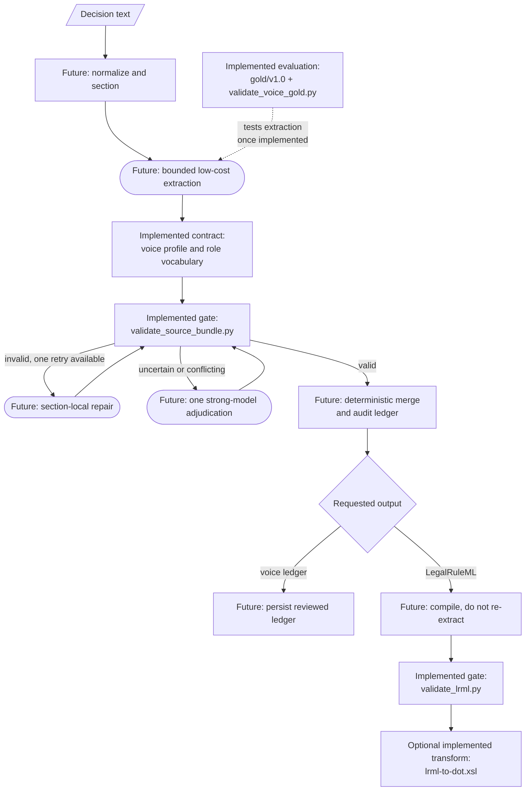

# Vedtak → LegalRuleML

This document describes a self-contained capability: **turning a Norwegian
Skatteklagenemnda _vedtak_ (tax-appeal decision) into a
[LegalRuleML](https://www.oasis-open.org/committees/legalruleml/) file that
represents its legal argumentation**, plus the tools that validate, visualize,
and search those files.

It is written so that a human or an AI agent can read it once and know **which
files matter, how they fit together, and how the modelling works** — including
for the purpose of lifting this functionality into its own repository. It has two
halves:

- **[Part A — The spec](#part-a--the-spec-how-a-vedtak-is-modelled-in-legalruleml):**
  how a vedtak is modelled in LegalRuleML, in summary and precisely.
- **[Part B — The agentic layer](#part-b--the-agentic-layer-how-the-agent-is-prompted):**
  how an AI agent is prompted to produce the files.

Read [Consumers](#consumers-what-reads-the-generated-files) and
[Migration notes](#migration-notes) last.

---

## Extraction profiles

This repository offers two separate profiles rather than making full legal-rule
formalization mandatory for every use case:

- **`voice-first`** emits one keyed JSON record per material statement, keeping
  the original speaker, procedural role, statement kind, a faithful searchable
  natural-language proposition, an exact quote and offsets, attribution basis,
  adoption status, and extraction confidence. Optional fields record endorsement
  and explicit supersession. See the complete schema and review checks in
  [the voice-first statement profile](wiki/mapping/voice-first-profile.md).
- **`formal-rules`** is the formal modelling profile documented in the remainder
  of this README. This checkout contains its guidance and validator, but not the
  inherited generator, reasoner, or persistence pipeline.

The `voice-first` profile does not require full RuleML rules, relation manifests,
hjemmel decomposition, temporal rule parameters, conflict reasoning, or SVG
rendering. It can be used independently or as reviewed input to a later
`formal-rules` run; its JSON assertions are natural-language propositions, not
RuleML predicates.

---

## File map — this checkout

This map is intentionally limited to tracked paths that are present in this
repository. References to the former host application are catalogued separately
below and must not be read as claims that its code is available here.

| Present path | Role |
|---|---|
| `legalruleml/wiki/` | Knowledge base: LegalRuleML concepts, formal mapping guidance, the voice-first application profile, annotation guidance, and the proposed bounded pipeline. |
| `legalruleml/application-profiles/voices/v1.0.json` | Versioned controlled vocabulary for voice-first procedural roles. |
| `legalruleml/evaluation/gold/v1.0/` | Versioned voice-first evaluation corpus, annotations, manifest, and release instructions. |
| `legalruleml/xsd-schema/` | Vendored OASIS LegalRuleML 1.0 compact XSD and local imports, patched for offline use as described in its `README.md`. |
| `legalruleml/bin/validate_lrml.py` | Implemented LRML/XSD, structure, sidecar, voice, relation, and hjemmel validator. |
| `legalruleml/bin/validate_source_bundle.py` | Implemented validator for normalized source manifests, voice ledgers, quote offsets, and optional PROV sidecars. |
| `legalruleml/bin/validate_voice_gold.py` | Implemented validator for the versioned voice-first gold release. |
| `legalruleml/tests/` | Unit tests for the three validators. |
| `legalruleml/viz/lrml-to-dot.xsl` | Implemented XSLT transform from LRML to Graphviz DOT. |
| `legalruleml/in/` | Read-only LegalRuleML specification and tutorial reference material. |

### Architecture inherited from `ratatouille` (not included)

The original file map and agentic narrative described integration code from a
larger host repository named **`ratatouille`**. None of the following paths or
commands exists in this checkout. The upstream URL, tag, and commit were not
recorded when this repository was extracted; consequently its version is
**unresolved/unpinned**, rather than implicitly “latest.” Importing it requires
first recording an immutable upstream URL and commit and then testing the
interfaces below.

| External component (absent here) | Repository / version | Interface expected by this project documentation |
|---|---|---|
| Generator skills (`.github/skills/vedtak-to-legalruleml*`) | `ratatouille`; upstream URL and commit **not recorded** | A `SKILL.md` prompt consumes a decision and repository-relative wiki guidance and emits temporary `.lrml`, `.prov.xml`, `.relations.json`, and `.svg` artifacts. The doc-feedback variant proposes documentation edits and waits for approval. |
| Headless runner (`pi_runner/run_skill.mjs`) and Pi Agent SDK | Wrapper: `ratatouille`, version **not recorded**; SDK package/version **not recorded** | Environment-variable configuration for provider credentials, model, skill directory, prompt, and working directory; stdout returns one JSON result and stderr carries progress. No Node package manifest or lockfile is included here. |
| Python package and `vedtak-legalruleml` CLI (`src/vedtak_legalruleml/`) | `ratatouille`; upstream URL and commit **not recorded** | Subcommands formerly expected: `validate`, `lrml-html`, `vedtak-to-lrml`, and `audit-law`; generation invokes the headless runner and validators before persistence. |
| Audit, Tonto/RDF/SHACL, conflict, search, and HTML-view components | `ratatouille`; upstream URL and commit **not recorded** | Inputs are LRML plus its sidecars and legal/ontology registers; outputs were audit proposals/reports, `conflicts.json`, searchable model rows, or self-contained HTML. No implementation, ontology, SHACL shapes, database schema, or search index is included here. |
| Model store, Rettsrev adapter, registers, samples, and `build/legalruleml.sqlite` | `ratatouille` and an external Rettsrev deployment; versions and schemas **not recorded** | The former host expected decision text/identity from Rettsrev, JSON legal registers/configuration, and an atomic SQLite row containing a complete validated bundle. This checkout defines no compatible database or API contract beyond that historical description. |
| `xmllint` / libxml2 | [GNOME libxml2](https://gitlab.gnome.org/GNOME/libxml2); version **not pinned** | `validate_lrml.py` invokes the `xmllint` executable with `--schema SCHEMA --noout FILE`; it must be on `PATH`. |
| `xsltproc` / libxslt | [GNOME libxslt](https://gitlab.gnome.org/GNOME/libxslt); version **not pinned** | Optional XSLT 1.0 command-line processor for `lrml-to-dot.xsl`; reads LRML and writes DOT text. |
| Graphviz `dot` | [Graphviz](https://gitlab.com/graphviz/graphviz); version **not pinned** | Optional renderer consuming DOT on stdin (or a file) and producing SVG with `-Tsvg`. |

The OASIS schema is the one external implementation that **is vendored**: it is
LegalRuleML Core Specification 1.0 (OASIS Standard, 30 August 2021), obtained
from the OASIS LegalRuleML repository/distribution and consumed through
`legalruleml/xsd-schema/compact/lrml-compact.xsd`. See the schema README for the
two local import patches. The tutorial and saved specification under
`legalruleml/in/` are documentation inputs, not runtime services.

## Currently runnable components

Only the following checked-in paths have runnable entry points:

- `legalruleml/bin/validate_lrml.py` validates an existing `.lrml` file and its
  optional/required sibling sidecars according to the selected flags.
- `legalruleml/bin/validate_source_bundle.py` validates a supplied source
  manifest and voice ledger, with an optional PROV file.
- `legalruleml/bin/validate_voice_gold.py` validates
  `legalruleml/evaluation/gold/v1.0/`.
- `legalruleml/tests/` runs with Python's standard-library `unittest` runner.
- `legalruleml/viz/lrml-to-dot.xsl` can be executed by an external XSLT 1.0
  processor such as `xsltproc`; Graphviz may then convert its DOT output.

There is **no checked-in extraction/generation orchestrator, agent skill, CLI,
database, audit pipeline, conflict reasoner, search UI, or HTML graph viewer**.

---

## Part A — The spec: how a vedtak is modelled in LegalRuleML

### A.1 Summary

LegalRuleML is the **target language**: a vedtak is natural-language legal
reasoning, and we emit LegalRuleML (XML, RuleML-based) that captures the
*argumentation* — not just the outcome, but the rule, the facts, the competing
readings, and which side won. The guiding requirements are **isomorphism** (every
rule traces to its hjemmel) and **defeasibility / alternatives** (losing
arguments are kept, not deleted).

A vedtak maps to constructs roughly as follows:

| Vedtak element | LegalRuleML construct |
|---|---|
| A cited provision (FSFIN § 6-44-4, or a pinpoint: § 6-44-1 andre ledd) | `LegalReference` + `LegalSource` (pinpoint URN) + a keyed one-hjemmel `Association` tying it to the rule |
| A vilkår whose defining provision differs from the rule’s | `@key` on that `<ruleml:Atom>` + its own `Association` to that pinpoint |
| "fradrag gis dersom … og … og …" (the rule) | `PrescriptiveStatement` → `ruleml:Rule`; each **vilkår** is an `Atom` in `ruleml:And` in `ruleml:if` |
| "innrømmes fradrag" / "har krav på" (consequence) | `ruleml:then` = a deontic operator (`Right`/`Permission`; `Obligation`/`Prohibition` for duties), Bearer = skattepliktige |
| "hva regnes som _ferge_" (a definition) | `ConstitutiveStatement` (no deontic head) |
| "Vilkåret om X er oppfylt" (a finding) | `FactualStatement` |
| who claims / decides / recommends / dissents | direct `Agent ← Role → expression` attribution |
| competing factual allegations | separate attributed `FactualStatement`s; no `Alternatives`/`Override` |
| competing legal renderings | `Alternatives`; adjudication `Context` selects the adopted reading |
| lex specialis/superior/posterior | `OverrideStatement` between Legal Rule statements |
| year-dependent threshold (kr 3 300 vs 5 000) | version-selected via inntektsår `Context` + `TemporalCharacteristic` |
| tilleggsskatt (penalty) | `Obligation` (duty) + `FactualStatement` (breach) + `PenaltyStatement`/`ReparationStatement` (sanction) |
| the operative result per year | explicit statement (a granted `Right`, or a `Neg` fact for a denial) |
| the exact sentence justifying a fragment | a PROV quote in the **`.prov.xml` sidecar**, linked to the fragment’s `@key` |

The formal semantic output is accompanied by an immutable source layer:
`<name>.source.json` captures the named source decision's normalized input and
SHA-256 digest, while `<name>.voices.json` records contiguous quote spans using
canonical document-relative character offsets. The formal artifacts are
`<name>.lrml` (the model), `<name>.prov.xml` (verbatim source quotes), and
`<name>.relations.json` (document-local canonical relation signatures and
evidence; see [A.4](#a4-the-sidecar-output)). The source/quote format and its
focused validator are documented in
[source manifests and quote locators](wiki/mapping/source-manifest.md).

### A.2 The precise modelling rules

These are the idioms that make a file **valid against the vendored OASIS compact
XSD**. They were reconciled against that schema and the spec’s own compact
examples; the wiki pages linked below carry the full reasoning.

**Document shell & order** ([concepts/document-structure.md](wiki/concepts/document-structure.md)).
Root `<lrml:LegalRuleML>`; top-level blocks in fixed category order: `Prefix*` →
metadata (`LegalReferences`, `LegalSources`, `Authorities`, `Jurisdictions`,
`Agents`, `Roles`, `Times`, `TemporalCharacteristics`) → `Associations` →
`Alternatives`/`Context`/`Statements`. Serialization is **compact**. The `.lrml`
contains **no** foreign-namespace markup (no PROV) — the XSD has no extension
point for it.

**Identifiers** ([concepts/identifiers.md](wiki/concepts/identifiers.md)).
`@key` is document-unique. On **RuleML** elements the key must be a CURIE
(`:r-fradrag`) or absolute IRI, not a bare NCName; the leading colon is stripped
for uniqueness and `#keyref` matching. The **empty prefix** (`:overstiger…`
CURIEs) is bound by the root’s default `xmlns` (the domain-ontology namespace) —
an empty `<lrml:Prefix>` is illegal. `<lrml:Prefix>` uses `pre` + `refID`
attributes.

**References & isomorphism** ([concepts/sources-isomorphism.md](wiki/concepts/sources-isomorphism.md)).
`<lrml:LegalReference>` takes **no `@key`**; its `@refersTo` (an NCName) *is* its
internal id, which `keyref="#…"` resolves to. `@refID` is the human citation,
`@refIDSystemName` the alias system. The provision’s canonical URN/URL lives on a
paired `<lrml:LegalSource>`’s `@sameAs`. Rules connect to references through an
`<lrml:Association>`.

**Hjemmel anchoring** ([concepts/hjemmel-anchoring.md](wiki/concepts/hjemmel-anchoring.md)).
The rules that make that link *precise*, so a fragment traces to the paragraph it
was read out of rather than to “the statute somewhere in this file”:
(1) **pinpoint** sources — one reference/source pair per cited level
(`…:paragraf:6:del:44:del:1:ledd:2`), never deeper than the text cites;
(2) **one hjemmel per `Association`**, keyed `assoc-<source-stem>` — an
Association pairs *every* source with *every* target, so a lumped one asserts
links the vedtak never made; broad metadata goes in its own source-free
Association; (3) **fragment-level anchors** — a `@key` on an individual
`<ruleml:Atom>` (schema-valid) lets one vilkår point at the ledd that defines it
while the rest of the rule points elsewhere; (4) the **statutory wording** as a
`quote-hjemmel-…` entity in the sidecar, quoted from the provision *and* from the
vedtak reproducing it.

**Statements** ([concepts/statements.md](wiki/concepts/statements.md)).
`ConstitutiveStatement`/`PrescriptiveStatement` wrap a `ruleml:Rule` (the
`hasTemplate` edge is skipped in compact). `FactualStatement` keeps an **explicit
`<lrml:hasTemplate>`** and holds a non-deontic formula (`Atom`/`Neg`/`And`/…) —
it may **not** contain a deontic operator; an unconditional grant is a
`PrescriptiveStatement` with an empty body (`<ruleml:if><ruleml:And/></ruleml:if>`).

**Rules & terms** ([concepts/ruleml-rules.md](wiki/concepts/ruleml-rules.md)).
`ruleml:Rule` with `@closure="universal"`; `ruleml:if` and `ruleml:then` are
**never** skippable. Vilkår → `Atom`s (`Rel` + `Var`/`Ind`/`Data`) in a single
`ruleml:And`. Year-dependent parameters must be **real terms** (`Data`/`Var`),
not comments, so a `Context` actually changes what the rule computes.

**Deontic heads** ([concepts/deontic.md](wiki/concepts/deontic.md)).
`Right`/`Permission`/`Obligation`/`Prohibition`. The party is a **slot key**:
`<ruleml:slot><lrml:Bearer iri="…"/><ruleml:Var>x</ruleml:Var></ruleml:slot>`
before the Atom — never `<lrml:Bearer>` wrapping the term. `SuborderList` holds
graded deontic specs directly (no `PrimaryDuty`/`CompensativeDuty`).
`<lrml:Violation keyref="#ps-x"/>` is a **rule-body formula**, never a standalone
fact — to assert a breach, use an ordinary `FactualStatement` with a domain
relation.

**Alternatives & defeasibility** ([concepts/alternatives.md](wiki/concepts/alternatives.md),
[concepts/defeasibility.md](wiki/concepts/defeasibility.md)).
`<lrml:Alternatives>` members are `<lrml:hasAlternative keyref>` **edges** (there
is no `<lrml:Alternative>` element). Use them for mutually exclusive legal
renderings and select the adopted reading with Context. `<lrml:OverrideStatement>`
holds `<lrml:Override over="#stronger-rule" under="#weaker-rule"/>` only for
actual defeasible Legal Rule priority. Rule strength is
`<lrml:hasStrength>` + `StrictStrength`/`DefeasibleStrength`/`Defeater`.

**Temporal** ([concepts/temporal.md](wiki/concepts/temporal.md)).
`<ruleml:Time key=":t-2022">` with `Data` limited to `xs:dateTime|date|duration`
(represent an inntektsår as its Jan 1 — **not** `xs:gYear`).
`<lrml:TemporalCharacteristic>` uses `forStatus` (IRIs from `…/ns/v1.0/vocab#`:
`Applicable`/`Efficacious`/`InForce`) and **`atTime`** (not `hasTime`).

**Associations & context** ([concepts/context-associations.md](wiki/concepts/context-associations.md)).
An `Association`’s only `applies*` edges are `appliesSource`,
`appliesTemporalCharacteristic(s)`, `appliesStrength`, `appliesModality`,
`appliesAuthority`, `appliesJurisdiction` (Context adds `appliesAssociation(s)`),
followed by `toTarget`. There is **no** `appliesTemporal`/`Time`/`Role`/`Agent`;
Agents attach through a `<lrml:Role>`’s `filledBy`/`forExpression`.

The compact skeleton and every idiom above are shown copy-pasteably in
[reference/element-cheatsheet.md](wiki/reference/element-cheatsheet.md); a
complete validated file is in
[mapping/worked-example.md](wiki/mapping/worked-example.md).

### A.3 Conformance & validation

A file conforms if it validates against the vendored compact XSD. The project
validator adds the constraints a schema cannot express:

```bash
python3 legalruleml/bin/validate_lrml.py [--strict] [--relations] [--hjemmel] <file>.lrml
```

It checks: XSD validity (via `xmllint`); no PROV inside the `.lrml`; `@key`
uniqueness and resolution of every local reference (`keyref`/`over`/`under`/
`hasCreationDate`); acyclicity of the key graph; `if`/`then` present on every
rule; and, when `<name>.prov.xml` exists, that every `wasQuotedFrom` resolves to
a declared `LegalSource` and every `wasDerivedFrom` links an existing `.lrml`
`@key` to an existing quote entity. Exit 0 = valid.

It also checks **hjemmel anchoring**: an `appliesSource` must name a
source/reference (error); an `Association` must not carry more than one hjemmel,
every `PrescriptiveStatement`/`ConstitutiveStatement` must be the direct target
of one, and every keyed rule fragment must be targeted (warnings — errors under
`--strict`, which is what the generator skill runs). `--hjemmel` prints the
traceability table (association → citation → URN → fragment → quote) for review.
`--relations` requires `<name>.relations.json` and checks its LRML hash, exact
IRI coverage, arity and argument kinds/order, statement usages, direct
procedural voices, and quote-backed source forms. It prints the canonical
relation table. Synonym grouping remains a source-reading task for the agent;
the deterministic validator checks that the completed grouping is applied
consistently.

### A.4 The sidecar output

Text-level isomorphism (the exact passage each fragment formalizes) is kept in a
**sidecar** `<name>.prov.xml` so the `.lrml` stays schema-pure. The sidecar is a
`<prov:Bundle>` of `<prov:Entity>` quotes (verbatim text in `<prov:value>` +
`<prov:wasQuotedFrom>` to a `LegalSource` key) plus `<prov:wasDerivedFrom>`
records linking each fragment’s `@key` to its quote — the fragment being a
statement, a rule, or a single keyed vilkår `Atom`. Statutory text is quoted
from the provision source (and from the vedtak that reproduces it); a finding
from the vedtak source. Details:
[concepts/sources-isomorphism.md §vedtak-quotes](wiki/concepts/sources-isomorphism.md#vedtak-quotes).

The sibling `<name>.relations.json` records the decision's canonical predicate
vocabulary: each IRI's meaning, arity, ordered semantic argument roles/kinds,
all statement usages and owning voices, and source formulations linked to PROV
quotes. It is deliberately local to one decision. Conflict analysis reads the
canonical symbols in LRML directly and performs no heuristic alias merging.

---

## Part B — The agentic layer: how the agent is prompted

Part B is an **architecture specification**, not a description of an executable
agent in this checkout. The checked-in wiki specifies prompts, data contracts,
validation rules, and a bounded voice-first design. The former `ratatouille`
host supplied the skills and orchestration described in the inherited-component
table above; those implementations were not imported.

### B.1 Proposed voice-first pipeline (future work)

The voice-first profile, role vocabulary, gold data, and deterministic
validators are implemented here. The pipeline that calls models and produces a
voice ledger is not. In the diagram, **Implemented** nodes name checked-in code
or data; **Future** nodes are design requirements from
[the bounded pipeline](wiki/mapping/pipeline-design.md), not runnable commands.



The retry and adjudication branches are deliberately finite. They express the
future orchestrator's call budget; the present validators do not call a model,
repair output, merge records, or persist results.

### B.2 Inherited formal-rules agent (not included)

The former host used two skills under
`.github/skills/vedtak-to-legalruleml*`: a routine generator and a
documentation-feedback variant. Their expected contract is recorded in the
inherited-component table, but neither `SKILL.md` is present. Therefore commands
such as `vedtak-legalruleml vedtak-to-lrml`, claims about Azure/Entra
authentication, Pi Agent SDK execution, conflict analysis, and atomic SQLite
persistence are historical architecture only and cannot be exercised here.

If these pieces are imported later, pin the `ratatouille` commit and Pi SDK
package version, add their dependency lockfiles, and test the following boundary:

1. input: normalized decision text plus explicitly versioned config/registers;
2. temporary output: `.lrml`, `.prov.xml`, and when requested
   `.voices.json`/`.relations.json`;
3. gate: invoke the checked-in validators as subprocesses and require exit 0;
4. optional rendering: invoke the checked-in XSLT; and
5. persistence: publish nothing until every requested artifact passes.

### B.3 The knowledge base (included)

The wiki is usable independently of the missing agent. Reading order:
[wiki/AGENTS.md](wiki/AGENTS.md) (stance and conventions) →
[wiki/index.md](wiki/index.md) (catalog) → `mapping/` (procedures and profile) →
`concepts/` (element semantics) → `reference/` (syntax). `wiki/log.md` is the
append-only documentation history. A future skill may consume these pages, but
no skill is required to read or validate them.

---

## Consumers — what reads the generated files

| Availability | Command / tool | What it does |
|---|---|---|
| Included | `python3 legalruleml/bin/validate_lrml.py [--strict] [--voices] [--relations] [--hjemmel] <f>.lrml` | Validate an LRML file and selected sidecar contracts. |
| Included | `python3 legalruleml/bin/validate_source_bundle.py MANIFEST VOICE_LEDGER [PROV]` | Validate normalization, hashes, exact quote offsets, and optional PROV links. |
| Included | `python3 legalruleml/bin/validate_voice_gold.py legalruleml/evaluation/gold/v1.0` | Validate the checked-in voice-first benchmark release. |
| Included, external executables required | `xsltproc legalruleml/viz/lrml-to-dot.xsl <f>.lrml \| dot -Tsvg -o <f>.svg` | Transform LRML to DOT and then SVG. |
| Not included | `vedtak-legalruleml …`, `søksbie …`, audit/conflict tools, and HTML viewer | Historical `ratatouille` consumers; no matching path or executable is present. |

---

## Migration notes

This checkout is a documentation, schema, validator, and evaluation subset—not
a complete migration of the former host capability. Preserve the relative
`legalruleml/bin/` → `legalruleml/xsd-schema/` layout because the LRML validator
resolves the vendored schema from it. Before restoring any inherited component,
record its upstream URL and immutable version, specify its input/output schema,
and add an integration test against the checked-in validators. Do not recreate
the absent SQLite, Rettsrev, ontology, or provider boundary from the historical
prose alone.
